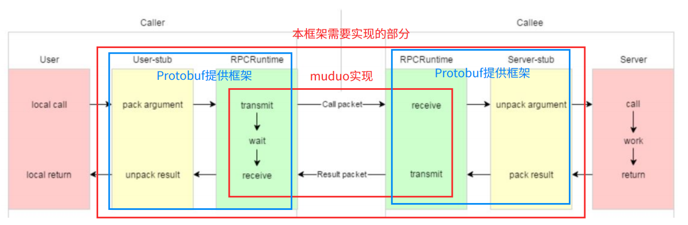
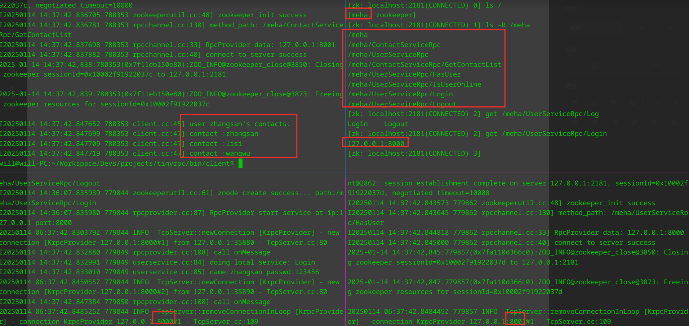

# tinyrpc

## 项目概述

Linux 环境下基于 muduo、Protobuf 和 Zookeeper 实现的一个轻量级 RPC 框架。可以把单体架构系统的本地方法调用，重构成基于 TCP 网络通信的 RPC 远程方法调用，实现统一台机器不同进程或者不同机器之间的服务调用。

- 基于 muduo 网络库实现高并发网络通信模块，作为 RPC 同步调用的基础。
- 基于 Protobuf 实现 RPC 方法调用和参数的序列化和反序列化，并根据其提供得 RPC 接口编写 RPC 服务。
- 基于 ZooKeeper 分布式协调服务中间件提供服务注册和服务发现功能。
- 设计了基于 TCP 传输的二进制协议，解决粘包问题，且能够高效传输服务名、方法名以及参数。



- 黄色部分：设计rpc方法参数的序列化和反序列化，以及请求调用和响应调用，使用Protobuf

- 绿色部分：
  - 使用muduo网络库来传输rpc调用请求和调用结果
  - 使用Zookeeper配置中心来实现服务注册和发现

## example

### 介绍

在example目录下，分别有callee和caller两个目录，分别对应服务发布端和调用端。

其中callee中，`EchoService` 和 `UserService` 是通过 `RpcProvider` 发布在同一个节点 `127.0.0.1:8000` 上的；而 `ContactService` 是发布在另一个节点 `127.0.0.1:8001` 上的。

两者共同说明了服务是可以分布式部署的，同一个 `RpcProvider` 发布的服务会共用同一个节点。且除了客户端和服务端之间可以调用，服务端之间也可以调用。

### 运行方法

启动zookeeper，可使用docker：`docker run --name zk1 -p 2181:2181 -it zookeeper bash`

进入到example目录下，运行server和client，即可完成服务发布和调用。

```shell
cd server
./userservice -i ../../example/callee/userservice.conf
./contactservice -i ../../example/callee/contactservice.conf
cd client
./client -i ../../example/caller/client.conf
```



## 主要技术点

- **muduo库**：负责数据流的网络通信，采用了多线程epoll模式的IO多路复用，让服务发布端接受服务调用端的连接请求，并由绑定的回调函数处理调用端的函数调用请求。

- **Protobuf**：负责RPC方法的注册，数据的序列化和反序列化，相比于文本存储的XML和JSON来说，Protobuf是二进制存储，且不需要存储额外的信息，效率更高。

- **Zookeeper**：负责分布式环境的服务注册，记录服务所在的IP地址以及端口号，可动态地为调用端提供目标服务所在发布端的IP地址与端口号，方便服务所在IP地址变动的及时更新。

- **TCP沾包问题处理**：定义服务发布端和调用端之间的消息传输格式，记录方法名和参数长度，防止沾包。

## TODO

- [ ] 性能测试
- [ ] 利用muduo库替换rpcchannel::callmethod中的send/recv
- [ ] 实现正确的rpccontroller
